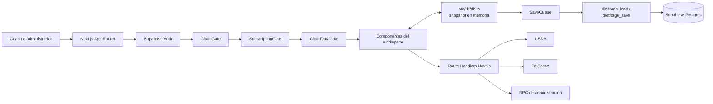
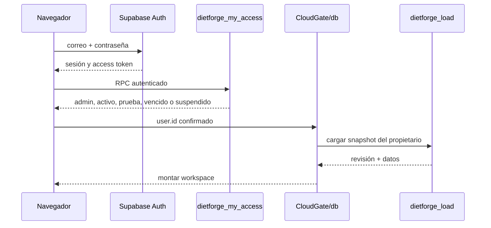
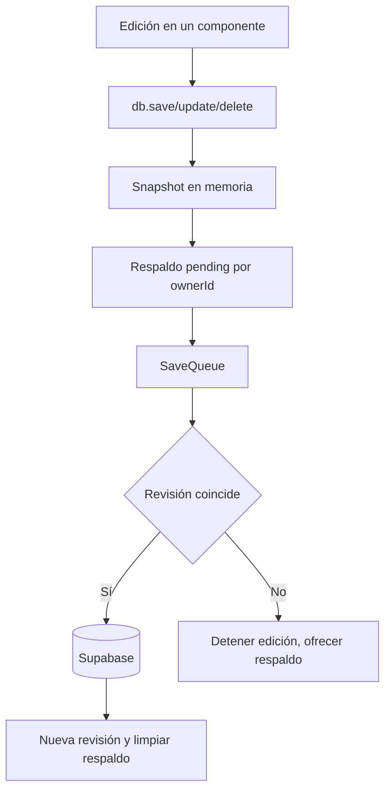
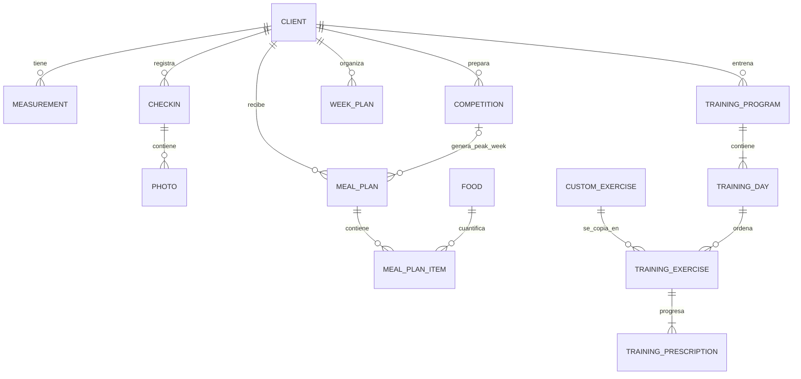
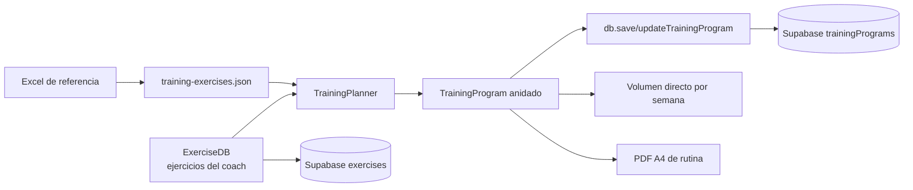

# Arquitectura y conexiones de DietForge

Actualizado: 2026-09-08. Este documento describe el sistema vigente. El historial detallado se conserva en la memoria externa de DietForge.

## Vista general

Las páginas de `src/app` son entradas ligeras. La lógica interactiva está en `src/components`; las reglas puras están en `src/lib`; los contratos compartidos están en `src/types`; Supabase aplica identidad, acceso y persistencia.

## Inicio de sesión, acceso y carga

`CloudGate` escucha `onAuthStateChange`, por lo que Supabase es la fuente de identidad. `SubscriptionProvider` consulta `dietforge_my_access` al cargar, al recuperar el foco y cada minuto. `SubscriptionGate` solo deja pasar cuentas activas, administradores o pruebas vigentes. `CloudDataGate` carga los datos después de superar el acceso comercial; así ningún componente consulta un snapshot perteneciente a otra cuenta.

La primera validación entra exclusivamente desde la invitación administrativa y una recuperación desde `Olvidé mi contraseña`; ambas pasan por `/auth/callback`. El token de un solo uso se elimina del historial y puede dirigir a `/auth/password`. El login no expone una solicitud manual de primera activación. Los accesos siguientes usan correo y contraseña en `/`. Después de autenticar, la pantalla consulta `dietforge_is_admin()` y dirige a `/admin` o al panel del coach según la respuesta del servidor.

## Persistencia y sincronización

`src/lib/db.ts` mantiene tres grupos en memoria:

- `database`: clientes, mediciones, competencias, check-ins, fotos, planes semanales, alimentos, planes de comidas, elementos de planes, rutinas, ejercicios propios e IDs siguientes.
- `templates`: plantillas de dieta.
- `preferences`: ajustes pequeños por cuenta, como Rest Day y secciones de comidas.

Cada operación de escritura modifica el snapshot y llama `persist()`. La cola guarda primero una copia local de recuperación y después invoca `dietforge_save(snapshot, revision, mutationId)`. Supabase bloquea el workspace, verifica la revisión, actualiza las colecciones y aumenta la revisión. Repetir el mismo `mutationId` devuelve el resultado anterior. Si otra sesión ya escribió, la revisión no coincide y la aplicación detiene el guardado para proteger ambas versiones.

En la primera apertura de una cuenta sin workspace, `initializeCloud` detecta datos heredados en `localStorage` y pide elegir entre importarlos o comenzar vacío. Los originales heredados no se borran.

## Relaciones funcionales

Los vínculos usan IDs numéricos dentro del snapshot de un propietario. Al eliminar un cliente, `db.deleteClient` limpia sus entidades dependientes y los elementos pertenecientes a sus planes.

## Programación de entrenamiento

`/training` muestra el portafolio de rutinas y `/clients/[id]/training` abre el editor del cliente. El modelo reproduce la lógica útil de la hoja **M1 Rotacion 1** sin trasladar sus límites visuales: perfil del bloque, objetivo, prioridades, split, 1–12 semanas, hasta siete días por semana, ejercicios ordenados, series, rango de repeticiones y RIR inicial/final, además de feedback al cierre. Cada entrada de `week_days` conserva su propia agenda: una semana puede tener cinco días y la siguiente tres. `days` refleja la semana 1 para que los registros anteriores sigan siendo legibles. La interfaz presenta ejercicios como filas con encabezados, mantiene las metas y tarjetas de volumen independientes por semana y coloca el feedback en la columna de revisión junto al día activo.

La biblioteca `src/data/training-exercises.json` se generó desde la hoja `Base de datos` del Excel de referencia y contiene 463 nombres únicos, sin videos predeterminados. `/exercises` los presenta dentro de “Mis ejercicios” junto con la base administrable por coach guardada en la colección Supabase `exercises`; esta permite nombre, grupo, indicaciones y un video elegido por ese coach. El botón **Video** precarga cualquier movimiento incluido y guarda una copia personalizada. `exerciseLibraryKey` y `mergedExerciseLibrary` hacen que esa copia tenga prioridad y oculten el original equivalente, evitando duplicados tanto en el catálogo como en el selector de rutinas. Al insertar cualquiera, se crea una copia dentro de la rutina para que las ediciones posteriores del catálogo no cambien programas ya asignados. Un ejercicio sin video permanece sin enlace en el editor, el portal y el PDF. El catálogo limita su lista visible a `min(62vh, 640px)` y desplaza solo los resultados; buscador, filtros y encabezado permanecen accesibles. En pantallas pequeñas usa una columna y un límite de `min(58vh, 620px)`.

`weeklyMuscleVolume` y `detailedVolume` recorren todos los ejercicios de todos los días de la semana seleccionada. El primero suma series directas del grupo principal y su frecuencia; el segundo mantiene por separado las series indirectas ponderadas. La tabla muestra todos los grupos de la biblioteca aunque estén en cero, compara las directas con `weekly_volume_targets[semana][grupo]` y dibuja progreso individual y general. Las metas son independientes por semana. Las prioridades solo resaltan grupos coincidentes; no cambian series. `copyTrainingWeek` copia una agenda completa sin compartir objetos y `resizeProgramWeeks` conserva semanas existentes. `trainingProgramIssues` detecta campos incompletos, semanas ausentes, rangos invertidos y volumen directo superior a 25 series para que el coach lo revise.

Los detalles de compatibilidad, suma y edición están en [TRAINING_WEEKS.md](TRAINING_WEEKS.md).

`trainingDateValue` produce la fecha civil local para el inicio del bloque. No utiliza la fecha UTC de `toISOString`, que puede representar el día siguiente durante la tarde/noche de América.

El editor adopta la referencia visual minimalista verde: recursos educativos compactos, resumen horizontal de volumen, pestañas de semana y día, biblioteca lateral y revisión de bloque. En móvil las franjas se desplazan horizontalmente. El modo oscuro utiliza los tokens clínicos y `prefers-reduced-motion` desactiva las animaciones.

`trainingProgramHtml` genera una salida A4 independiente con una semana por página, cabeceras repetibles, cortes controlados, URLs seguras y texto escapado. El PDF presenta la prescripción definida por el coach; no diagnostica ni modifica el programa.

## Plan de comidas y Rest Day

`MealPlanner` obtiene plan, cliente, última medición y alimentos por medio de `db`. `itemsForDay` separa elementos normales y de descanso según `day_type`. Las listas de cuadros visibles también se guardan por separado en `preferences.meal_sections_{planId}`.

Desde `Planes anteriores`, la acción `Ver` precarga la ruta, marca la fila como `Abriendo…` y reproduce una salida breve de 280 ms antes de navegar. `MealPlanner` entra con una transición de opacidad y desplazamiento de 500 ms. Con movimiento reducido, la navegación ocurre inmediatamente.

Al activar Rest Day:

1. se guarda `preferences.rd_{planId}`;
2. la interfaz muestra ambas columnas y dirige la selección a Rest Day;
3. `restTargets` aplica el porcentaje de `preferences.rd_percent_{planId}` a calorías y macros objetivo;
4. `mealTotals` suma los nutrientes reales solo de los elementos del día correspondiente;
5. agregar o eliminar conserva la otra columna intacta;
6. la cuadrícula de macros y la cuadrícula de comidas transicionan durante 1050 ms de una columna a dos al activar y vuelven de dos a una antes de desmontar Rest Day al desactivar;
7. el control acompaña el cambio con una animación breve y todo respeta `prefers-reduced-motion`.

Al eliminar una comida, la tarjeta sale primero. Si no existe una tarjeta de la otra modalidad en esa posición, el contenedor completo contrae su fila durante 620 ms antes de actualizar secciones y datos; así las comidas inferiores se reajustan progresivamente. Los botones de alta cambian de color según Normal/Rest Day y muestran una onda circular al activarse.

`foodRatio` normaliza la cantidad a la base nutricional por 100 g/ml. Gramos y mililitros usan factor 1; libras usan 453.59237; pieza usa el peso declarado de la porción. El PDF y las plantillas exportan únicamente el día activo.

El título se edita en línea. Una cadena vacía restaura el título previo y los datos históricos vacíos se presentan como `Plan sin título`, de modo que el punto de edición nunca desaparece.

Las exportaciones de dieta y progreso generan documentos A4 con identidad visual esmeralda, encabezados de tabla repetibles y bloques que evitan cortes internos. Todo texto procedente de clientes, alimentos, fases o notas se codifica antes de insertarse en HTML y la ventana de impresión se separa de `window.opener`.

En impresión, `@page` define el margen físico y el contenido comienza en flujo normal. Las tarjetas pequeñas permanecen enteras; una comida extensa permite que la tabla continúe en otra página, conserva cada fila íntegra y repite el encabezado. Esto evita recortes aunque el plan supere una hoja.

## Peak Week

`PeakWeekSimulator` y `PeakCalendar` editan el calendario. `peakDates` calcula siete fechas en UTC, desde seis días antes hasta la competencia. Cada día puede tener fase, recordatorios, notas y macros propios. `dailyMacros` usa el valor diario cuando existe y recurre a los macros base cuando no existe; las calorías se calculan con proteína×4 + carbohidratos×4 + grasa×9.

`COMPETITION_PHASES` define el selector visible de fases e incluye Peak Week. Al elegirla, el resumen usa los factores de `PHASE_REQUIREMENTS.peak_week` y el expediente sustituye el bloque de competencias por el calendario editable de la competencia seleccionada.

`savePeakPlans` crea o actualiza un plan por combinación de competencia y fecha. `mergePeakConfig` conserva configuraciones de otras semanas y reemplaza solamente los siete días editados.

## Administración y suscripciones

El panel llama `POST /api/admin/coaches`. El Route Handler valida el bearer token con `dietforge_is_admin`; solo el servidor usa `SUPABASE_SERVICE_ROLE_KEY` para invitar por correo una identidad Auth todavía inexistente. La invitación vuelve a `/auth/callback?next=password`, confirma el correo y entrega una sesión de un solo uso para que el coach defina su propia contraseña. Luego ejecuta `dietforge_admin_set_access` con un `requestId` idempotente. Una cuenta existente no recibe otra invitación al renovarse y conserva su contraseña.

`DELETE /api/admin/coaches` comprueba el mismo rol, valida correo e identificador idempotente y ejecuta `dietforge_admin_delete_coach`. La RPC impide eliminar administradores y retira workspace, actividad y acceso; el handler con service role elimina los objetos del bucket privado y finalmente la identidad Auth. La interfaz exige escribir el correo exacto antes de enviar la operación y el historial conserva el movimiento administrativo.

La pantalla de acceso vive en `/` y sirve a todos los roles. No muestra un acceso administrativo separado ni compara el correo con una identidad conocida: después de validar la contraseña consulta `dietforge_is_admin()` contra la sesión Auth y dirige al administrador a `/admin`; cualquier cuenta no administradora continúa al panel de coach. `/admin/login` redirige a `/` para conservar enlaces antiguos.

## Seguridad web

Next.js publica encabezados para evitar interpretación MIME, iframes, filtración amplia del referente y acceso accidental a cámara, micrófono o ubicación. La CSP limita `base-uri`, formularios, marcos y objetos sin restringir scripts internos de Next.js. Las API usan bearer tokens explícitos, validan entrada y no devuelven cuerpos de proveedores que puedan contener credenciales. Véase `docs/SECURITY_REVIEW.md` para el análisis y los riesgos operativos pendientes.

Supabase combina periodos manuales y pagos Stripe. La fecha efectiva es el vencimiento más lejano permitido. La existencia de un periodo pagado prevalece sobre cualquier prueba histórica: cuando vence, `dietforge_my_access` devuelve `expired` hasta una renovación. Suspender bloquea el acceso sin borrar datos. Reanudar elimina la suspensión sin sumar tiempo. Renovaciones, suspensiones, reanudaciones y eliminaciones quedan en `dietforge_access_audit`.

## Búsqueda de alimentos

`src/lib/nutrition.ts` llama `/api/nutrition/usda` o `/api/nutrition/fatsecret` con la sesión actual. El Route Handler comprueba `dietforge_has_access`, conserva las credenciales en servidor, aplica límites a la búsqueda y no devuelve errores internos del proveedor. La base de alimentos propia sigue disponible cuando un proveedor externo falla.

`FoodDB` conserva alta manual, importación, consulta y eliminación. `NutritionWheel` calcula la participación energética del catálogo con proteína×4, carbohidratos×4 y grasa×9. Seleccionar un segmento filtra alimentos por su macronutriente energético dominante; el panel informativo y las fuentes concentradas se derivan del catálogo real. Quitar el filtro restaura la lista completa. La selección por teclado, el modo oscuro y movimiento reducido forman parte del contrato visual.

## Sistema visual y paneles

`src/index.css` contiene los tokens clínicos compartidos de canvas, superficie, texto, borde y marca. `Layout` usa esos tokens para la navegación clara/esmeralda y su variante oscura. Dashboard, Base de Alimentos, Administración, Panel Coach, Calculadora, Reportes, Clientes, expediente y planificación semanal tienen composiciones especializadas sobre el mismo sistema. Todas conservan modo oscuro, foco visible, movimiento reducido y adaptación móvil sin cambiar sus contratos funcionales.

La navegación de `Layout` conserva Dashboard y Clientes como destinos principales y agrupa el resto por intención. Seguimiento contiene Panel Coach, Agenda y Reportes; Planificación contiene Rutinas, Alimentos y Ejercicios; Sistema contiene Calidad y respaldos y, únicamente para administradores, Administración. La ruta `/calculator` se conserva para accesos contextuales desde el expediente y enlaces internos, pero no se muestra como apartado independiente en el menú. El grupo de la ruta actual permanece abierto, el encabezado resuelve también rutas hijas y cada control expone `aria-expanded`/`aria-controls`. La misma estructura funciona dentro del panel móvil.

Panel Coach resume el portafolio y sus alertas; Clientes ofrece búsqueda, estados y acceso al expediente; Reportes separa indicadores, gráficas y tabla operativa; Calculadora agrupa captura antropométrica y resultados; el expediente concentra acciones, evolución, competencias y planes; Planificación Semanal muestra los siete días en tarjetas consistentes y usa desplazamiento horizontal cuando el ancho no permite leerlos sin compresión. Los colores se aplican por semántica y nunca crean cifras que no provengan de `db` o de los cálculos de dominio.

El Dashboard calcula todas sus métricas desde `db`: actividad en 14 días, adherencia a partir de check-ins, promedio calórico y distribución energética de planes. La consola administrativa presenta únicamente estados devueltos por `dietforge_admin_list`; no infiere facturación ni ingresos que el backend todavía no registra.

La calculadora separa borrador y persistencia. `handleCalc` calcula y conserva temporalmente la evaluación; `saveCalculatedMacros` llama a `saveMacroEvaluation` solo después de la aceptación del coach. Cancelar no escribe datos. Durante el borrador existe un único bloque editable; al guardar, se cierra y el registro aparece con transición en el historial. Ninguna evaluación genera check-ins. `macroEvaluationAt` permite recorrerlas desde la más reciente sin sustituir el historial. `progressChart` combina peso y grasa de evaluaciones y check-ins como puntos antropométricos; si coinciden en fecha, el check-in tiene prioridad. Los promedios, la tendencia, la adherencia y las sugerencias de ajuste consumen exclusivamente check-ins. `weightComparison` y `bodyFatComparison` comparan los dos registros más recientes de cada métrica por fecha. El panel biométrico reúne indicadores y ambas curvas en una sola tarjeta. `CloudGate` mantiene la persistencia normal en silencio y solo presenta la franja global cuando `SaveState.phase` es `error`.

## Cálculos, seguimiento y salidas

- `calculator.ts`, `metrics.ts`, `phases.ts` y `carbCycle.ts` producen metas y análisis sin depender de React.
- `CheckInForm`, `CheckInHistory`, `trends.ts`, `progression.ts` y `alerts.ts` conectan seguimiento con recomendaciones.
- `pdf.ts` genera el plan imprimible; `progressReport.ts` genera el reporte; `csv.ts` exporta mediciones.
- `WeekPlanView` organiza una semana; `BatchAssign` aplica planes a varios días.

## Entrada numérica

`WorkspaceProviders` monta `NumericInputNormalizer` una sola vez dentro del área autenticada. El componente escucha eventos `input` sobre cualquier `input[type="number"]`, llama `normalizeNumericInput` y reenvía a React el valor corregido. La regla elimina únicamente ceros enteros redundantes (`050` → `50`, `00.5` → `0.5`) y conserva vacío, signo y decimales válidos. También reemplaza el spinner blanco de WebKit: la zona derecha del campo llama `stepUp` o `stepDown`, respeta límites y paso, y conserva las teclas de flecha del control semántico. CSS dibuja el mismo control verde en modo claro y oscuro.

## Seguridad y límites

Las claves públicas de Supabase pueden estar en el navegador; la service role y las credenciales nutricionales permanecen en Route Handlers o funciones server-side. Las políticas y RPC usan `auth.uid()`. El snapshot se valida antes de adoptarlo. Los mensajes de proveedores omiten URLs, cuerpos y secretos.

La aplicación necesita un servidor Next.js y no debe desplegarse como HTML estático. La aplicación Tauri y Vite conservada en `legacy` no participa en la ejecución web vigente.

## Validación

- `npm test`: lógica de dominio, acceso, cola cloud, componentes, Rest Day, Peak Week, entrenamiento y APIs simuladas.
- `npm run typecheck`: tipos de rutas Next.js y TypeScript.
- `npm run lint`: reglas estáticas; revisar advertencias, aunque no bloqueen.
- `npm run build`: compilación real de las rutas.
- `tests/sql/admin-access.sql`: prueba transaccional del acceso; requiere Supabase vinculado y revierte cambios.
- `tests/sql/training-weeks.sql`: comprueba en Supabase que el portal valida el día contra la semana elegida y que una sesión no puede falsificar su prescripción.
- `tests/web-smoke.mjs`: navegación de navegador cuando el entorno permite Chrome.

No afirmar validación completa de producción basándose solo en mocks. Correo real, proveedores reales, varios dispositivos e impresión necesitan comprobaciones explícitas en sus entornos.

## Seguimiento, portal y recuperación (2026-09-08)

Ver [contratos, uso, seguridad y límites](CLIENT_CARE.md). Se añadieron actividades separadas del snapshot, portal por correo verificado, progresión aprobada por coach, plantillas, volumen indirecto, agenda y respaldos transaccionales.

## Disponibilidad y beta

La RPC pública `dietforge_healthcheck()` responde sin leer datos. `scripts/supabase-healthcheck.mjs` la valida desde GitHub Actions cada tres días. En producción, `vercel.json` invoca diariamente `GET /api/cron/supabase-health`; el Route Handler exige el bearer `CRON_SECRET` y usa únicamente la anon key. Ambas rutas son señales periódicas independientes; no prometen evitar la pausa del plan gratuito. El estado y los criterios para abrir el producto están en [BETA_READINESS.md](BETA_READINESS.md).

## Revisión y videos personalizables

Ver [revisión de cierre](FINAL_REVIEW_2026-09-08.md) y [contratos de videos](TRAINING_MEDIA.md). El catálogo con alimentos existentes nunca se reinicia al actualizar la semilla. Los resúmenes externos se normalizan solo con base explícita. Las prescripciones se clonan sin compartir referencias y se validan todas las semanas. Los archivos de entrenamiento son privados y su acceso depende de la rutina activa asignada, no de conocer su URL.

Los macros guardados mantienen la acción Ajustar macros en ClientDetail. El editor único compara contra el registro seleccionado; Guardar actualiza únicamente sus campos nutricionales mediante updateMeasurement, conserva ID, fecha y antropometría; Cancelar no escribe. Un cálculo nuevo usa saveMacroEvaluation.

BiometricChart presenta una curva de ancho completo con selector peso/grasa, periodos relativos al último registro, área degradada, tooltip y media de registros de los últimos siete días. La media es visual y no modifica el seguimiento. Los valores ausentes no se convierten a cero.

El ajuste de macros guardados se monta en la sección superior, en la posición del resumen, mientras la calculadora permanece cerrada. macroEditor se comparte con resultados nuevos sin duplicación. Los inputs de sus tarjetas usan data-plain-number para excluir los steppers globales visuales y de puntero; mantienen sus botones −/+.

## Check-in del portal y notificaciones — 2026-09-14

El cliente envía fecha/peso y opcionalmente medidas, adherencia, bienestar, notas y fotos desde Progreso. La grasa corporal no se captura ni serializa desde el cliente; el trigger SQL rechaza el campo fuera de la identidad del coach. Estos registros viven en `dietforge_client_activity`, no se importan automáticamente al snapshot ni a las gráficas del coach. La evaluación manual del coach sigue independiente.

`checkin-photos` es privado, admite JPG/PNG/WebP de hasta 5 MB por archivo, máximo ocho posiciones por check-in. Las rutas están acotadas a propietario/cliente y las URLs firmadas caducan en cinco minutos. Reemplazar una foto crea otro objeto y conserva las referencias históricas.

Un INSERT de check-in del cliente crea transaccionalmente una notificación única `(owner_id, client_id, activity_id)`. Los reintentos del mismo UUID actualizan el registro y no notifican de nuevo. La campana global obtiene 50 entradas y el contador total no leído mediante RPC restringido al propietario. El destino abre Progreso y el UUID; la marca de lectura se solicita solo si el registro existe. No se envían correos.

La sincronización consulta cada cinco segundos después de completar una lectura, sin solicitudes superpuestas, pausa en segundo plano y reintenta con backoff hasta 60 s. No es Supabase Realtime ni garantiza latencia instantánea. Actualiza datos recibidos sin reinicializar borradores. Los formularios permanecen montados al cambiar pestañas internas. Un envío de check-in pendiente conserva borrador y UUID en sessionStorage por propietario/cliente para recuperarlo tras recargar la misma pestaña; se elimina al confirmar. Si el navegador bloquea ese almacenamiento, la recuperación queda limitada a la vista montada.

## Avisos de alimentación y portal — 2026-09-14

`useDietNotice` consulta cada 5 s `dietforge_diet_notice_read(o,c)` en el portal cliente. El botón Comida muestra un aviso pendiente; abrir la pestaña muestra el mensaje y cerrar ejecuta `dietforge_diet_notice_seen(o,c,v)`. La lectura se persiste por usuario y versión en tablas privadas; cerrar una versión obsoleta no descarta la nueva. El aviso cubre altas/ajustes/eliminaciones de planes, partidas y alimentos referenciados tras guardar el snapshot completo. Orden del snapshot y timestamps no generan avisos. La migración inicial establece base sin avisos retroactivos. Retirar/restaurar un expediente limpia sus lecturas previas.

Agenda muestra exclusivamente Peak Week y check-ins; no crea recordatorios ni muestra entrenamientos/alimentación regular. No se borraron actividades históricas. `care-tab-panel` establece separación interna entre tarjetas y respeta `hidden`; las rejillas adaptables contienen formularios/tablas sin ensanchar el portal.

### Portal: activación guiada (2026-09-14)
PortalAuth separa correo autorizado, creación de contraseña y confirmación. El registro usa Supabase Auth y el callback existente; completar el formulario no concede acceso a expedientes. Login y recuperación siguen disponibles. Los mensajes viven dentro de la tarjeta, las contraseñas se limpian tras la petición y no se persisten. Consultar acceso descarta respuestas tras cambiar de identidad.
